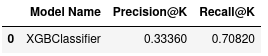

# Health Insurance Cross Sell

## The Context

This project was based on the Kaggle's dataset 'Health Insurance Cross Sell Prediction'. To make it more interesting, a hypothetical industry-driven situation was formulated by Meigaron Lopes. Insurance All is a company that provides health insurance to its customers and the product team is analyzing the possibility of offering policyholders a new product: auto insurance. Insurance All conducted a survey of about 380,000 customers about their interest in joining a new auto insurance product last year. All customers expressed interest or not in purchasing auto insurance and these responses were saved in a database along with other customer attributes. The product team selected 127 thousand new customers who did not respond to the survey to participate in a campaign, in which they will receive the offer of the new auto insurance product. The offer will be made by the sales team through telephone calls. However, the sales team has the capacity to make 20 thousand calls within the campaign period.

Kaggle Dataset: https://www.kaggle.com/anmolkumar/health-insurance-cross-sell-prediction

Business context (Portuguese Brazil): https://sejaumdatascientist.com/como-usar-data-science-para-fazer-a-empresa-vender-mais/

 

## The Challenge

In that context, it is necessary build a model that predicts whether or not the customer would be interested in auto insurance. With its solution, the sales team hopes to be able to prioritize the people with the greatest interest in the new product and optimize the campaign by making only contacts with customers most likely to make the purchase.

As a result of the project, it is needed to deliver a report containing some analysis and answers to the following questions:

- Main Insights about the most relevant attributes of customers interested in purchasing auto insurance.

- What percentage of customers interested in purchasing auto insurance will the sales team be able to contact by making 20,000 calls?

- And if the sales team's capacity increases to 40,000 calls, what percentage of customers interested in purchasing auto insurance will the sales team be able to contact?

- How many calls does the sales team need to make to contact 80% of customers interested in purchasing auto insurance?

 

## The Solution

The solution offered is a machine learning algorithm that can rank customers by the highest probability of accepting a new car insurance. To achieve this goal, a cyclic model called CRISP-DS (Cross Industry Process for Data Science) was used. Several machine learning models were tested, and LGBM was chosen as the best algorithm.  

Not only were all the questions answered, but a Google spreadsheet was offered with a button that just clicking on it will give the probabilities of each customer on the spreadsheet. 

 

## Project Development

### Understanding the Dataset

The dataset is composed by the following variables:

- Id: Customer ID
- Gender: Customer Gender
- Customer Age: Customer Age
- Region Code: The code of the region that customer lives
- Policy Sales Channel: The code for the customer disclosure channel (mail, phone, agents, etc.)
- Driving License: Customer has a license 1; customer has no license 0
- Vehicle Age: The age of the vehicle
- Vehicle Damage: If the vehicle has been damaged in the past, yes or no
- Previously Insured: If the customer has a previous insurance, no: 0, yes: 1
- Annual Premium: How much the customer paid the company for annual health insurance
- Vintage: Number of days the customer joined the company through the purchase of health insurance.
- Response: The customer has interest in buy the car insurance, no: 0, yes: 1

 

#### Keys points:

According to the **Pandas Profile Report** the following key points can be highlighted:

- The data set has no missing cells or duplicate rows
- There are more men (54.1%) than women (45.9%)
- The age ranges from 20 to 85 years. The average age is 38 years and the distribution is positively skewed (0.67). There is a peak at the ages of 23 and 24, both representing 13.2% of all ages
- The most common region code is 28, representing 27.9% of all 53 codes
- The most common policy sales channel are 152 (35.4%), 26 (20.9%) and 124 (19.4%)
- Most customers have a driver's license (99.8%)
- Most vehicles are between 1 and 2 years old (52.6%), followed by vehicles under 1 year old (43.2%) and over 2 years old (4.2%)
- Most vehicles were damaged (50.5%)
- Most customers have already been assured (54.2%)
- The average of annual premium is 30564, in addition to a minimum of 2630 and a maximum of 540165. The distribution is highly skewed (1.76) and has a kurtosis of 34, which implies that there are many outliers and data is concentrated at the beginning of the curve
- The target variable (response) is quite unbalanced, since 87.7% of customers answered "no" to a new auto insurance proposal

 

### Mind Map

 

### Feature Engineering

Based on the mind map and pandas profile report the following features were developed:

- age_damage
- vintage_annual_premium
- age_vintage
- age_damage_premium

 

### Hypothesis Test - Insight Generation:
Based on the previous analysis, six hypotheses were made and answered:

#### H1 - Older customers are more likely to take out a car insurance 
- False - People between 40 and 50 are more likely to take out a car insurance

#### H2 - Women are more likely to take out a car insurance
- False - Women are not more likely to take out a car insurance

#### H3 - Customers with older cars are more likely to take out a car insurance
- False - Customers with cars between 1 and 2 years are more likely to take out a car insurance

#### H4 - Customers previously insured are more likely to take out a car insurance
- True - Customers previously insured are more likely to take out a car insurance

#### H5 - Customers with previously damaged cars are more likely to take out a car insurance
- True - Customers with previously damaged cars are more likely to take out a car insurance

#### H6 - Customers with higher annual premium are more likely to take out a car insurance
- False - Customers with lower annual premium are more likely to take out a car insurance

 

### Multivariate Analisys

#### Pearson Correlation - Numeraical Features

#### Cramer's V (Pandas Profiling)

 

### Data Preparation and Feature Selection

Both steps has not returned any improvements, so it was decided to go with all features just encoding categorical features:

- gender and vehicle age -> label enconding
- vehicle_age - ordinal enconding

 

### Machine Learning and Cross Validation

Several algorithms were tested, but from all of them just LGBM, Hist Gradient Boosting (HGB) and XGBoost were chosen as the best models.

#### LGBM

#### HGB

#### XGB

 

### Hyperparameter Optimization - Test Dataset

Unfortunately, Hyperparameter Optimization has not returned any improvements on the test dataset:

#### HGB
Tuned

Default

#### LGBM
Tuned

Default

#### XGB
Tuned

Default

#### LGBM was chosen as the best ML model overall:

 

### Business Questions Answers

#### 1 - The most relevant attributes of customers interested in purchasing auto insurance.

- Age (Customers around 40 and 50 years old)
- Vehicle Age (Customers with cars between 1 and 2 years)
- Customers Previously Insured
- Customers with Previously Damaged Car

#### 2 - What percentage of customers interested in purchasing auto insurance will the sales team be able to contact by making 20,000 calls?

#### 3 - If the sales team's capacity increases to 40,000 calls, what percentage of customers interested in purchasing auto insurance will the sales team be able to contact?

#### 4 - How many calls does the sales team need to make to contact 80% of customers interested in purchasing auto insurance?

